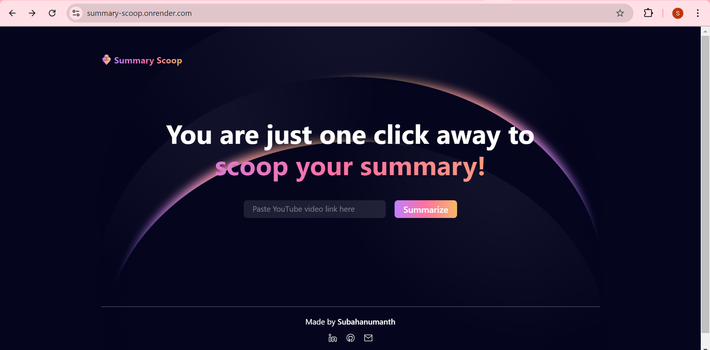
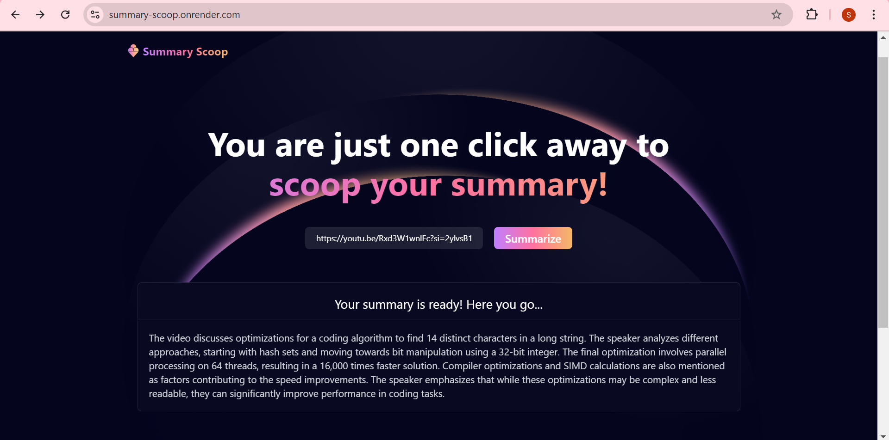

# Summary Scoop 

### Live Demo: [Visit Summary Scoop](https://summary-scoop.onrender.com)

## Table of Contents

- [Introduction](#introduction)
- [Features](#features)
- [Screenshots](#screenshots)
- [Technologies Used](#technologies-used)
- [Usage](#usage)

## Introduction

**Summary Scoop** is a simple, intuitive web application that allows users to summarize YouTube videos in just one click! Paste a YouTube video link, and the app provides a concise summary of the content. It's designed to save users time by offering instant summaries of long videos.

## Features

- 🎥 **YouTube Video Summarization**: Get quick summaries for any YouTube video.
- 🧠 **Easy to Use**: User-friendly interface with an intuitive design.
- ⏳ **Fast and Reliable**: Quick responses powered by API integration.
- 🌐 **Responsive Design**: Works across all devices, including desktops and mobile phones.

## Screenshots

### 1. **Home Page**

### 2. **Summary Generation**

## Technologies Used

- **Frontend**: React, Tailwind CSS
- **Backend**: Node.js, Express.js
- **Deployment**: Render, Docker

## Usage

- **Paste YouTube Link**: Enter a valid YouTube URL into the input field.
- **Summarize**: Click the "Summarize" button to fetch and display the video summary.
- **View Summary**: The summarized content will appear below, along with a scrollbar if the text is lengthy.
